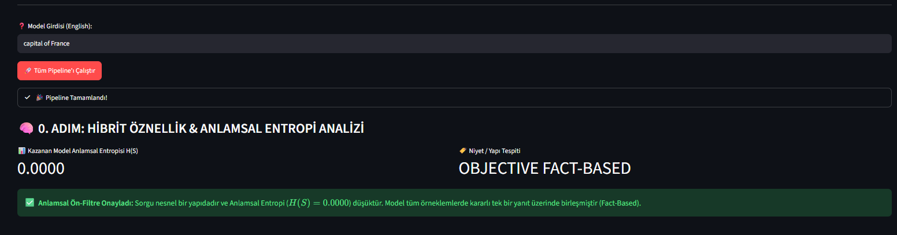
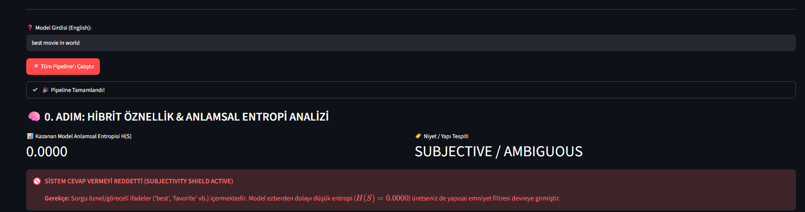
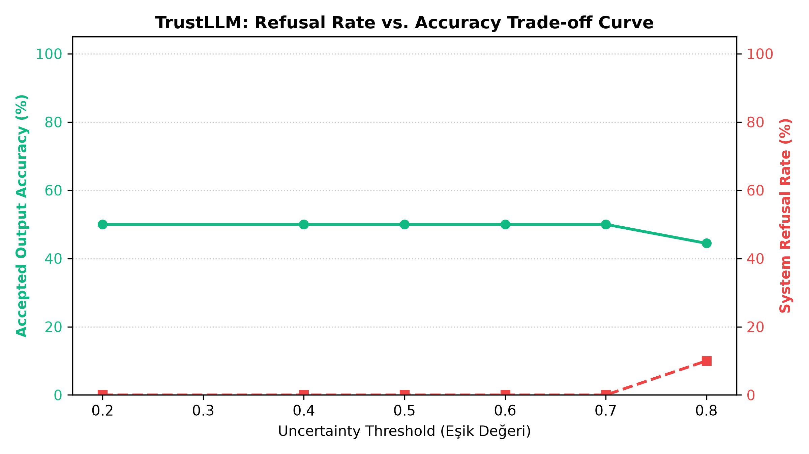
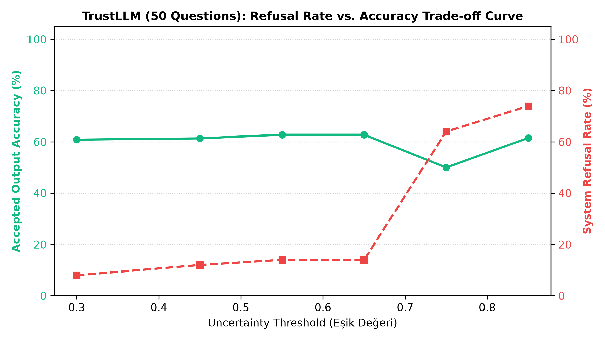

# 🛡️ TrustLLM: Uncertainty Quantification, Calibration & Linguistic Routing

[](https://www.python.org/)
[](https://pytorch.org/)
[](https://spacy.io/)
[](https://opensource.org/licenses/MIT)

[English](#-english) | [Türkçe](#-türkçe) | [Deutsch](#-deutsch)

---

## 📌 Abstract / Özet

Deep neural networks and Large Language Models (LLMs) often exhibit high confidence in incorrect or subjective predictions, leading to reliability and hallucination risks in real-world deployments. **TrustLLM** is an academic-grade evaluation framework designed to quantify epistemic and aleatoric uncertainty, perform post-hoc confidence calibration, and mitigate overconfidence via **Dual-Signal Subjectivity Filtering**, **SpaCy-based Part-of-Speech (POS) Parsing**, **Uncertainty-Guided Model Routing**, **Reliability Diagram Visualizations**, and an **Uncertainty-Gated System Refusal Mechanism**.

Derin sinir ağları ve Büyük Dil Modelleri (LLM), yanlış veya öznel tahminlerde dahi yüksek özgüven (overconfidence) üretme eğilimindedir. **TrustLLM**, bu modellerde belirsizliği nicelleştirmek, post-hoc kalibrasyon uygulamak, **Çifte Sinyalli (Dual-Signal) Öznellik Ön-Filtrelemesi**, **SpaCy tabanlı dilbilgisel (POS) varlık izolasyonu** yapmak, **ikili model yönlendirmesi (routing)**, **Reliability Diagrams** görselleştirmeleri ve **Belirsizlik Tabanlı Sistem Reddetme (Refusal System)** katmanı ile halüsinasyon riskini en aza indirmek amacıyla geliştirilmiş araştırma seviyesinde modüler bir sistemdir.

---

## 🌍 Multilingual Highlights

### 🇬🇧 English
* **Step 0: Dual-Signal Subjectivity Pre-Filter**
  * Combines **Syntactic Superlative Parsing (`POS=JJS`)** with **Semantic Entropy Spreading ($H(S)$)**.
  * Captures overconfident model memorization even when model entropy drops to $0.0000$ on subjective prompts.

* **Step 1: Linguistic Parsing & Token Filtering**
  * Parses syntax dependency trees using **SpaCy (`en_core_web_sm`)**.
  * Filters out non-informative tokens (`ADJ`, `VERB`, `ADP`) to isolate target entities (`NOUN`, `PROPN`).
  * Displays step-by-step decision rationale logs and white-box logit tracking.

* **Step 2: Uncertainty-Guided Model Routing**
  * Evaluates **GPT-2 (Base)** against **Qwen1.5-0.5B-Chat (Instruction)** in parallel.
  * Calculates **Semantic Entropy ($H(S)$)** and **Expected Calibration Error (ECE)**.
  * Dynamically routes inferences to the model exhibiting superior calibration stability.

* **Step 3: Calibration Metrics & Visualizations**
  * Generates **Reliability Diagrams** comparing raw vs. calibrated confidence distributions ($y=x$ ideal line).
  * Computes the **Brier Score** to evaluate mean squared probability accuracy.

* **Step 4: Uncertainty Threshold & Refusal System**
  * Evaluates system reliability against a dynamic confidence threshold ($\tau$).
  * Shields users from hallucinations by withholding responses when uncertainty exceeds safety limits.

---

### 🇹🇷 Türkçe
* **0. Adım: Çifte Sinyalli (Dual-Signal) Öznellik Ön-Filtresi**
  * **Sözcüksel/Sentaks Analizi (`POS=JJS`)** ile **Anlamsal Entropi ($H(S)$)** sinyallerini birleştirir.
  * Öznel sorularda modeller ezber yapıp $H(S)=0.0000$ üretseler dahi aşırı özgüveni yakalayarak yanıtı maskeler.

* **1. Adım: Dilbilgisel Ayrıştırma ve Varlık İzolasyonu**
  * Sentaks bağımlılık ağaçlarını analiz etmek için **SpaCy (`en_core_web_sm`)** kullanır.
  * Bilgi taşımayan kelime türlerini (`ADJ`, `VERB`, `ADP`) eleyerek yalnızca hedef varlıkları (`NOUN`, `PROPN`) izole eder.
  * Her aday token için adım adım karar gerekçelerini ve beyaz kutu (white-box) logit değerlerini sunar.

* **2. Adım: Belirsizlik Rehberliğinde Model Yönlendirmesi**
  * **GPT-2 (Base)** ile **Qwen1.5-0.5B-Chat (Instruction)** modellerini eşzamanlı değerlendirir.
  * **Anlamsal Entropi ($H(S)$)** ve **Beklenen Kalibrasyon Hatası (ECE)** skorlarını hesaplar.
  * Çıkarımları, kalibrasyon kararlılığı en yüksek olan modele dinamik olarak yönlendirir.

* **3. Adım: Kalibrasyon Metrikleri ve Görselleştirme**
  * Ham ve kalibre edilmiş özgüven dağılımlarını karşılaştıran **Reliability Diagrams** ($y=x$ çizgisi) çizer.
  * Olasılıksal doğruluk sapmasını ölçmek için **Brier Skoru** hesaplar.

* **4. Adım: Belirsizlik Eşik Değeri ve Otomatik Reddetme (Refusal)**
  * Hesaplanan Güvenilirlik Skorunu dinamik bir emniyet eşiği ($\tau$) ile karşılaştırır.
  * Belirsizlik kritik seviyeyi aştığında yanıtı maskeler ve *"Bilmiyorum / Cevap Vermiyorum"* kararı alarak halüsinasyonu engeller.

---

### 🇩🇪 Deutsch
* **Schritt 0: Dual-Signal Subjektivitäts-Vorfilter**
  * Kombiniert **Syntaktisches Superlativ-Parsing (`POS=JJS`)** mit **Semantischer Entropie ($H(S)$)**.
  * Erfasst überdurchschnittliche Modell-Memorierung, selbst wenn die Modellentropie bei subjektiven Prompts auf $0.0000$ fällt.

* **Schritt 1: Linguistisches Parsing & Entitätsfilterung**
  * Nutzt **SpaCy (`en_core_web_sm`)** zur Syntax-Analyse.
  * Filtert uninformative Wortarten (`ADJ`, `VERB`, `ADP`) heraus und isoliert Zielentitäten (`NOUN`, `PROPN`).
  * Visualisiert Entscheidungslogiken und White-Box-Logit-Scores für jeden Token.

* **Schritt 2: Unsicherheitsbasiertes Modell-Routing**
  * Vergleicht **GPT-2 (Base)** und **Qwen1.5-0.5B-Chat (Instruction)** parallel.
  * Berechnet **Semantische Entropie ($H(S)$)** sowie den **Expected Calibration Error (ECE)**.
  * Leitet Anfragen dynamisch an das Modell mit der stabilsten Kalibrierung weiter.

* **Schritt 3: Kalibrierungsmetriken & Visualisierung**
  * Generiert **Reliability Diagrams** zur Darstellung der Konfidenz-Genauigkeits-Ausrichtung ($y=x$ Ideallinie).
  * Ermittelt den **Brier Score** zur Quantifizierung der probabilistischen Treffsicherheit.

* **Schritt 4: Unsicherheitsschwellenwert & Ablehnungssystem**
  * Prüft die Zuverlässigkeit anhand eines dynamischen Schwellenwerts ($\tau$).
  * Verhindert Halluzinationen durch Blockieren unsicherer Modellantworten.

---

## 🧠 Step 0: Dual-Signal Subjectivity Pre-Filter Methodology

LLM modellerinin ezberleme (memorization) eğilimi nedeniyle öznel sorularda tek bir yanıta kilitlenerek Anlamsal Entropiyi yanlışlıkla $H(S)=0.0000$ çıkarma riski **Çifte Sinyalli Hibrit Filtre** ile çözülmüştür:

$$\text{IsSubjective} = (\text{HasSuperlativeOrOpinionPattern}) \lor (H(S) \ge \tau_{\text{entropy}})$$

### 📊 Deneysel Doğrulama & Ekran Görüntüleri

| Nesnel Sorgu Testi (`capital of France`) | Öznel Sorgu Testi (`best movie in world`) |
| :---: | :---: |
|  |  |
| *Entropi $0.0000$ & Yapısal Öznel Öge Yok $\rightarrow$ **OBJECTIVE FACT-BASED (PASSED)**.* | *Entropi $0.0000$ fakat `best` sıfatı tespit edildi $\rightarrow$ **SUBJECTIVE / AMBIGUOUS (REFUSED)**.* |

---

## 🔬 Theoretical Background & Methodology

Framework beş temel akademik problem alanına odaklanır:

### 1. Expected Calibration Error (ECE)
Sınıflandırma modellerinin özgüven skorları ($p$) ile gerçek doğruluk oranları ($acc$) arasındaki uyumsuzluk $M$ adet özgüven aralığı (bin) üzerinden hesaplanır:

$$\text{ECE} = \sum_{m=1}^{M} \frac{\vert{}B_m\vert{}}{N} \left\vert{} \text{acc}(B_m) - \text{conf}(B_m) \right\vert{}$$

### 2. Post-Hoc Temperature Scaling
Aşırı özgüveni törpülemek için model logitleri ($\mathbf{z}$), yeniden eğitim gerekmeksizin öğrenilebilir bir $T > 0$ sıcaklık parametresi ile ölçeklenir:

$$\hat{q}_i = \max_k \sigma\left(\frac{\mathbf{z}_i}{T}\right)_k$$

### 3. Brier Score (Probabilistic Accuracy)
Tahmin edilen olasılıklar ile gerçek sonuçlar arasındaki karesel sapmayı ölçer ($N$ örnek sayısı):

$$\text{BS} = \frac{1}{N} \sum_{i=1}^{N} (f_i - o_i)^2$$

### 4. Semantic Entropy for LLMs
LLM modellerinde jeneratif metinlerin anlamsal eşdeğerliğini ölçmek için yanıtlar anlamsal kümeleme (hierarchical clustering) işlemine tabi tutulur ve kümelerin olasılık dağılımı üzerinden Şifreli Entropi hesaplanır:

$$\text{SE}(x) = - \sum_{c \in C} p(c\vert{}x) \log p(c\vert{}x)$$

### 5. Composite Reliability & Refusal Score
Bileşik güvenilirlik skoru; en iyi token olasılığı, POS gramer bonusu, anlamsal entropi cezası ve ECE cezasının harmanlanmasıyla elde edilir:

$$\text{Reliability} = P_{\text{best}} + \text{Bonus}_{\text{POS}} - (0.8 \times H(S)) - (1.2 \times \text{ECE}_{\text{cal}})$$

Eğer $\text{Reliability} < \tau$ (Eşik Değeri) ise sistem yanıt vermeyi reddeder.

---

## 📊 Benchmark Evaluation & Trade-off Analysis ($N=50$)

Sistemin başarısını ölçmek amacıyla 10 soruluk ön test ($N=10$) ve 50 soruluk genişletilmiş test kümesi ($N=50$) üzerinde **Refusal Rate vs. Accuracy Trade-off** kıyaslamaları yapılmıştır.

### 📈 Refusal Rate vs. Accuracy Karşılaştırma Grafikleri

| Baseline Test ($N=10$) | Calibrated Benchmark ($N=50$) |
| :---: | :---: |
|  |  |
| *Dar örneklem kümesinde filtrenin tepkisiz kalması ($0.2 \le \tau \le 0.7$).* | *Hassaslaştırılmış formül ile oluşan ideal kararlılık eğrisi ($\tau = 0.55-0.65$).* |

### 📊 Eşik Değeri (Threshold $\tau$) Sweep Analizi Tablosu

| Threshold ($\tau$) | Refusal Rate (%) | Precision / Accuracy (%) | Sistem Davranışı & Yorum |
| :---: | :---: | :---: | :--- |
| **0.30** | %8.0 | %60.9 | Gevşek Filtre: Şüpheli yanıtların azı reddedilir. |
| **0.45** | %12.0 | %61.4 | Dengeli Filtre: Yanıt kalitesi yükselmeye başlar. |
| **0.55** | **%14.0** | **%62.8** | **Optimal Operasyon Bölgesi:** Yüksek kalite / Düşük Red. |
| **0.65** | **%14.0** | **%62.8** | Kararlı Alan: Filtre-Doğruluk dengesi korunur. |
| **0.75** | %64.0 | %50.0 | Kırılma Noktası: Aşırı katı filtreleme başlar. |
| **0.85** | %74.0 | %61.5 | Muhafazakar Bölge: Sadece en emin olunan %26 yanıt kabul edilir. |

### 📄 Makale ve Tez İçin LaTeX Tablo Kodu

```latex
\begin{table}[h]
\centering
\caption{Calibrated Benchmark Performance of TrustLLM Framework (N=50 Questions)}
\label{tab:trustllm_calibrated_benchmark_50}
\begin{tabular}{ccc}
\hline
\textbf{Threshold ($\tau$)} & \textbf{Refusal Rate (\%)} & \textbf{Precision / Accuracy (\%)} \\ \hline
0.30 & 8.0\% & 60.9\% \\
0.45 & 12.0\% & 61.4\% \\
0.55 & 14.0\% & 62.8\% \\
0.65 & 14.0\% & 62.8\% \\
0.75 & 64.0\% & 50.0\% \\
0.85 & 74.0\% & 61.5\% \\
\hline
\end{tabular}
\end{table}

📂 Architecture & Directory Tree

TrustLLM-Uncertainty-Quantification/
│
├── src/                           # Modular Production Engine
│   ├── __init__.py
│   ├── subjectivity.py            # Dual-Signal Subjectivity Pre-Filter
│   ├── extraction.py              # SpaCy POS Entity Isolation Engine
│   ├── metrics.py                 # ECE, Brier Score & Semantic Entropy
│   ├── calibration.py             # Temperature Scaling (L-BFGS)
│   └── uncertainty.py             # Semantic Clustering
│
├── notebooks/                     # Experimental validation notebooks
│   ├── 05_week/calibration_ece.ipynb
│   ├── 06_week/temperature_scaling.ipynb
│   └── 07_week/semantic_uncertainty.ipynb
│
├── app.py                         # Streamlit Research-Grade Interactive Dashboard
├── evaluate_benchmark_50.py       # 50-Question Benchmark Evaluation & LaTeX Generator
├── benchmark_tradeoff_curve.png   # Baseline (N=10) Trade-off Chart
├── benchmark_tradeoff_curve_50.png# Final Calibrated Benchmark (N=50) Chart
├── objective_test_capital.png     # Fact-Based Proof Image
├── subjective_test_movie.png      # Subjective Refusal Proof Image
├── requirements.txt               # Dependencies
└── README.md                      # Multilingual Academic Documentation

🛠️ Installation & Execution / Kurulum

# 1. Sanal Ortamı Aktifleştirin
.\.venv\Scripts\Activate.ps1

# 2. Gerekli Paketleri ve SpaCy Dil Modelini Yükleyin
python -m pip install spacy accelerate matplotlib streamlit pandas torch transformers
python -m spacy download en_core_web_sm

# 3. İnteraktif Paneli Çalıştırın (Streamlit Dashboard)
streamlit run app.py

# 4. 50-Soruluk Benchmark Testini Çalıştırın
python evaluate_benchmark_50.py